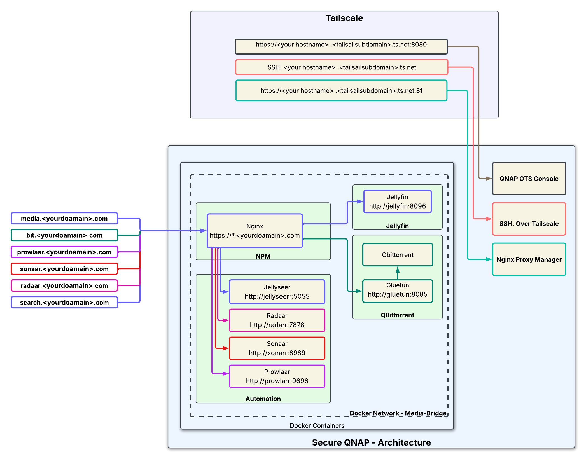
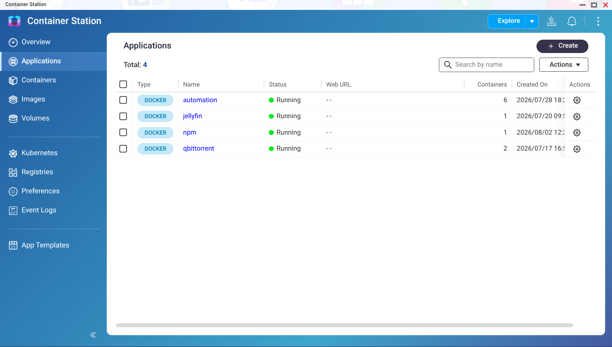
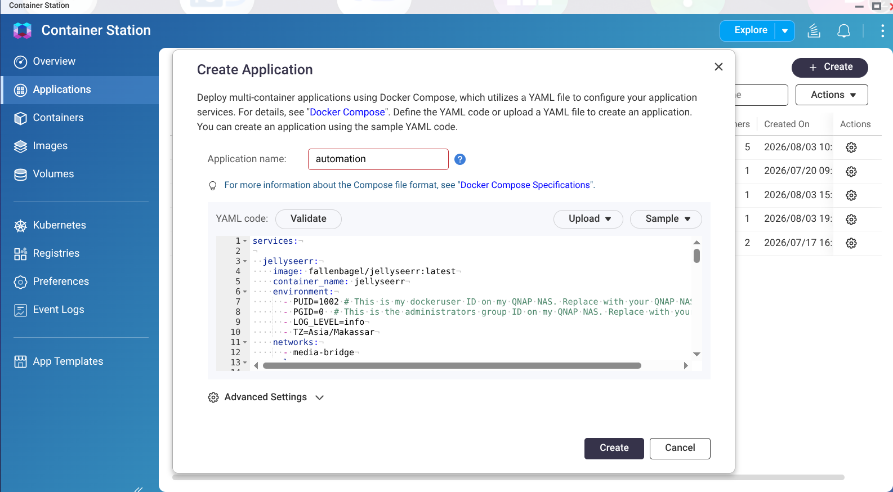
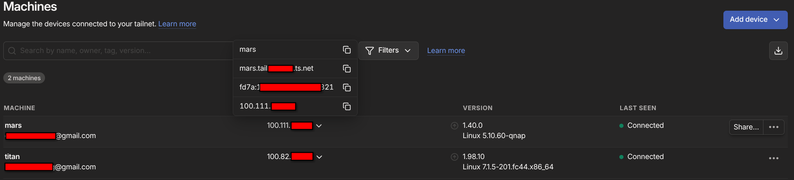
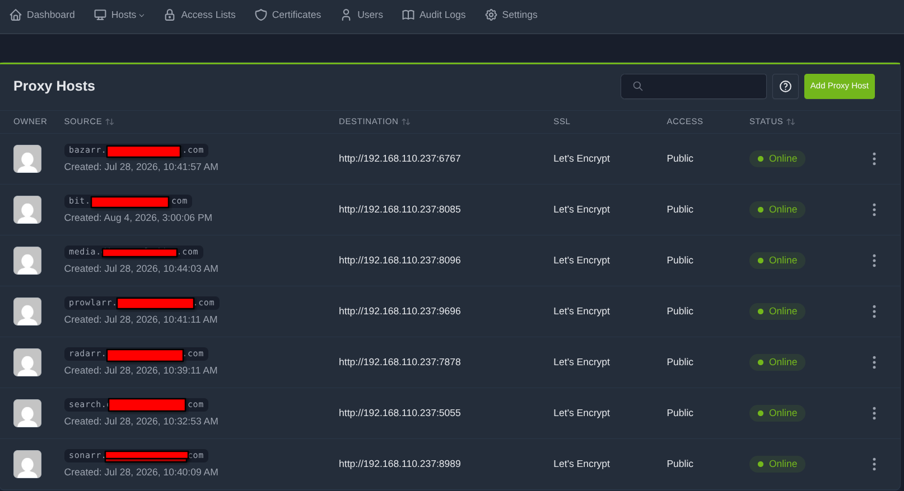
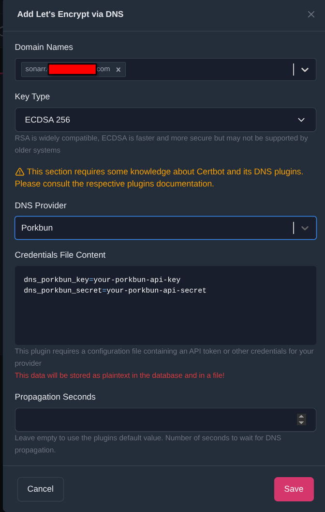
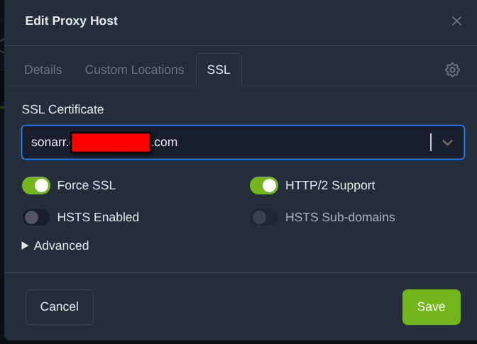
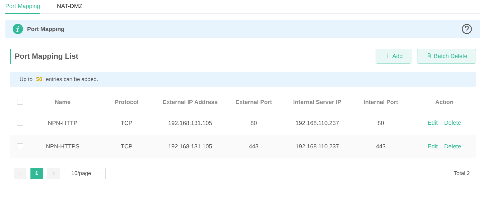
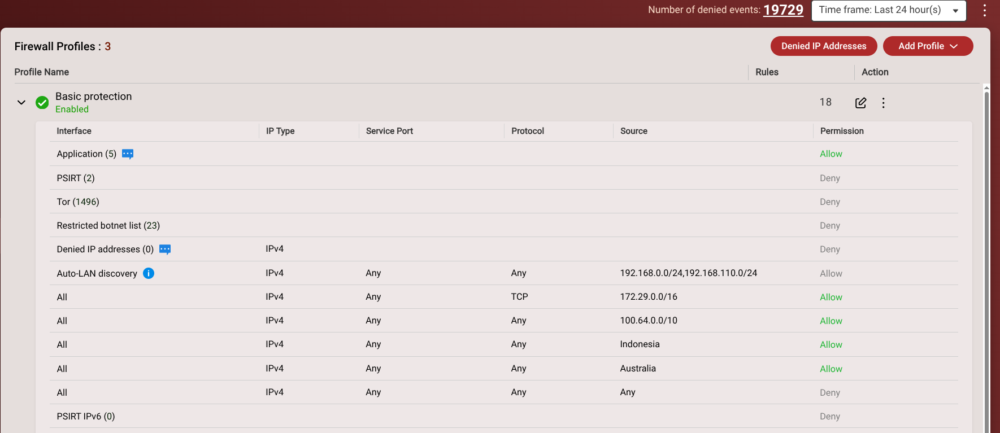
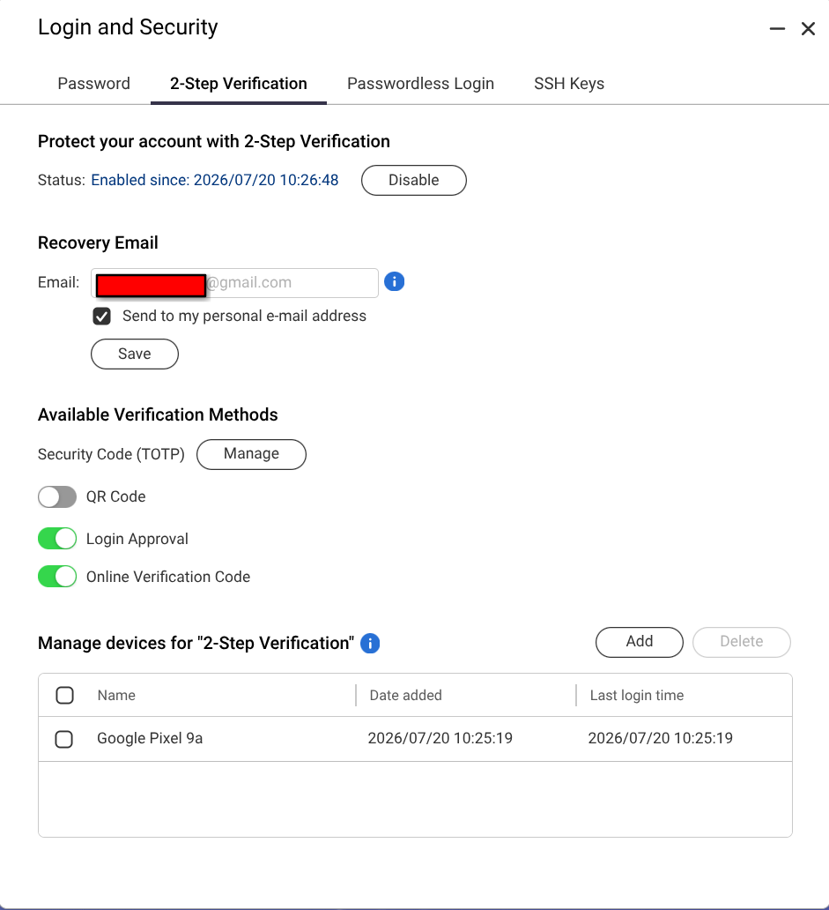

= Building a Secure Homelab: Setting Up Jellyfin, the 'Arr Stack, Tailscale, and Nginx on a QNAP NAS

== Legal & Educational Disclaimer

[NOTE]
====
This guide is provided strictly for educational and technical informational purposes. The software applications referenced in this tutorial (including Jellyfin, Sonarr, Radarr, and related tools) are designed to organize, manage, and stream personal, legally acquired media collections or public-domain content. The author does not host, distribute, or condone the unauthorized acquisition or distribution of copyrighted material. Follow all local copyright laws and service terms when setting up self-hosted environments.
====

== Introduction & Architecture Overview

I will be travelling between countries for the next 12 months or so and wanted to set up a secure, media-centric home lab that I could access remotely. I also wanted to ensure that the services I was exposing to the internet were secure and not vulnerable to attacks. I decided to use a QNAP NAS (TS-464 with 16gb of RAM and currently 2 16tb drives) as the base for my home lab, as it provides a powerful and flexible platform for running containers and managing media files.

In this guide, we will walk through the process of setting up a secure, media-centric home lab using a QNAP NAS. The goal is to create a system that allows for remote management and access while maintaining strong security practices. The architecture will leverage containerization, reverse proxying, and mesh VPN technology to ensure that sensitive services are not exposed directly to the internet.

== The Stack

* Media & Automation: Jellyfin, Sonarr, Radarr, Jellyseerr, Prowlarr, Qbittorrent.
* Networking & Security: Tailscale (Mesh VPN) and Nginx Proxy Manager / Nginx (Reverse Proxy with SSL).
* Hardware/OS: QNAP NAS (Container Station / Docker Compose). This document should work with any NAS that allows containers and is sufficiently powerful to cope with the demands of this stack.

Broadly, the architecture can be visualized as follows:

....
User (Remote) -> Tailscale -> QNAP QTS Console & SSH (Internal/Private)
User (Browser/App/Google TV) -> Nginx Reverse Proxy (SSL) -> Jellyfin (Exposed/Public)
....

== Prerequisites

* A QNAP NAS running Container Station (or Docker/Docker Compose). Any system that supports containerization will work.
* A Tailscale account.
* A personal domain name (if using custom URLs via Nginx with Porkbun/Cloudflare/Let's Encrypt).
* Basic familiarity with SSH and YAML configuration.
* Github account (optional, for storing configuration files and version control). 

== Base Environment & Container Deployment

Setting up Docker Compose / Container Station structure on QNAP.

I decided to use a private GitHub repository to store my configuration files. This allows me to version control my configuration and easily deploy it on other systems. I also use a `.env` file to store sensitive information such as API keys and passwords. This file is not checked into version control for security reasons. Each container requires sensitive parameters has its own .env, which is included in the main `docker-compose.yml` file. This allows for easy management and updates of individual containers without affecting the entire stack.

The respository provides a cloud backup of the configuration files, which can be useful in case of hardware failure or if I need to set up the stack on a new system.

I created a user 'dockeruser' on the QNAP NAS with, in my case, a UID of 1002 and GID of 1000. This user is used to run the containers and access the shared folders. The user has read/write permissions to the shared folders used by the containers. The ownership and permissions of the shared folders are set to allow the 'dockeruser' to read and write files, Adiministrators are the only other users with access to the folders. This ensures that the containers can access the necessary files without exposing sensitive data to other users on the NAS.

These are the directory structures I created on the QNAP NAS for the containers and their data:

[cols="1,2", options="header"]
|===
| Folder | Description
| /share/Media | for Movies and TV Shows
| /share/Media/downloads | for qbittorrent files
| /share/Media/downloads/complete | for Completed downloads
| /share/Media/downloads/incomplete | for incomplete (in progress downloads)
| /share/Media/Movies | Contains all the movies
| /share/Media/TV | All the TV Shows
| /share/Docker | Contains all of the docker containers, configure and their own data files
| /share/Docker/automation | The download automation tools containers
| /share/Docker/automation/bazaar | Subtitle management container
| /share/Docker/automation/jellyseerr | Content Search Engine container
| /share/Docker/automation/prowlarr | Index Server
| /share/Docker/automation/radarr | Movie Management container
| /share/Docker/automation/sonarr | TV Show Management container
| /share/Docker/npn | Nginx Reverse Proxy container
| /share/Docker/jellyfin | The Jellyfin media server/player container
| /share/Docker/qbittorrent | Qbittorrent and Gluetun containers
|===

The ownership of the /share/media folders is set to dockeuer and everyone.
The ownership of the /share/Docker folders is set to dockeruser and administrators. 

The permissions are set to allow read/write access for the owner and group, and read-only access for others. This ensures that the containers can access the necessary files without exposing sensitive data to other users on the NAS.

== Application Deployment

In Container Station, I have created these applications (docker-compose) containers:
* Jellyfin
* Qbittorrent (with Gluetun VPN)
* Automation containers (Jellyseerr, Sonarr, Radarr, Prowlarr, Bazarr)
* NPM (Nginx Proxy Manager)

These are all in separate docker-compose files, which are included in the main `docker-compose.yml` file. This allows for easy management and updates of individual containers without affecting the entire stack.

The Container Station application page looks like this:

To create an application in Container Station, click on the "Create Application" button and select "Import Docker Compose". Then, select the docker-compose file for the application you want to create. This will create the application and start the container. I have named all my docker-compose files with the name of the container, for example, `jellyfin.yaml`, `qbittorrent.yaml`, `automation.yaml`, and `npn.yaml`. This makes it easy to identify which file corresponds to which container as well as gives the application a meaningful name in Container Station. The application will be created with the name of the docker-compose file, for example, `jellyfin`, `qbittorrent`, `automation`, and `npn`. This makes it easy to identify which application corresponds to which container.

These are the docker-compose files for each container:

Note: I have named the docker-compose files with the name of the container, for example, `jellyfin.yaml`, `qbittorrent.yaml`, `automation.yaml`, and `npn.yaml`. This makes it easy to identify which file corresponds to which container.

=== Jellyfin

.jellyfin.yaml (docker-compose) file contains the configuration for the Jellyfin container. Jellyfin is a free and open-source media server that allows you to organize, manage, and stream your media files to various devices.
[source,yaml]
----
include::jellyfin.yaml[]
----

=== Qbittorrent

.qbittorrent.yaml (docker-compose) file contains the configuration for the Qbittorrent container including the Gluetun VPN container. The Gluetun container is used to route the Qbittorrent traffic through a VPN for privacy and security.

I use ProtonVPN as my VPN provider. You will need to create a ProtonVPN (paid) account and obtain your own configuration files and credentials. The Gluetun container will use these files to connect to the ProtonVPN servers.  You will need to modify the .env file for the Gluetun container with your ProtonVPN credentials and configuration files.
There are examples of the configration for major VPN providers out there in Internet land if you don't use ProtonVPN. You will need to modify the .env file for the Gluetun container with your VPN provider's credentials and configuration files.

[source,yaml]
----
include::qbittorrent.yaml[]

----

=== Automation
.automation.yaml (docker-compose) file contains the configuration for the automation containers. These containers are used to automate the downloading and organization of media files. The automation containers include Prowlarr, Sonarr, Radarr, and Bazarr.
[source,yaml]
----
include::automation.yaml[]
----

=== Nginx Proxy Manager
.npm.yaml (docker-compose) file contains the configuration for the Nginx Proxy Manager container. Nginx Proxy Manager is a web-based interface for managing Nginx reverse proxy and SSL certificates. It allows you to easily configure and manage your reverse proxy and SSL certificates for the services running

[source,yaml]
----
include::npm.yaml[]
----

=== Porkbun-DDNS
Porkbun is a domain registrar that provides a free Dynamic DNS service. This service allows you to update your domain's DNS records automatically when your IP address changes. This is useful for home networks that have dynamic IP addresses that are not behind a CGNAT. You will need to create a Porkbun account and obtain your API key and secret. You will need to modify the .env file for the Porkbun-DDNS container with your Porkbun credentials and configuration files.

I had to get a fixed IP address from my ISP (at a small cost) to make everything work properly.  This allowed me to use a reverse proxy to access the NAS services externally without having to use a VPN or Cloudflare tunnel. This also meant I didn't need to setup a Dynamic DNS service. I've left this here as it might be useful for someone else who doesn't have a fixed IP address, isn't behind a CGNAT and wants to use a Dynamic DNS service.
[source,yaml]
----
include::porkbun-ddns.yaml[]
----

[NOTE]
====
I had issues with the .env file being read and used by Container Station when creating new applications. I manually stitched together the .env file and the docker-compose file into a single file and used that to create the application. There will be a solution to this, but I got bored and just wanted to get the stack up and running. If you have a better way to do this, please let me know. 
====

== Securing Admin Access via Tailscale

Why Tailscale? Avoid direct port forwarding for high-risk ports such as SSH (Port 22), QTS Admin Console (Ports 8080) and the Nginx Proxy Manager UI on port 81.

=== Tailscale on the QNAP NAS

Install the Tailscale package on QNAP using App Center. There are detailed instructions on the Tailscale site.
Click the link to authenticate. 
The authentication step failed for me, so in a terminal session I typed this:
----
sudo tailscale up
----
Copy the generated URL and paste into a browser tab. Login into Tailscale. The tailscale command on the NAS should show 'Success'.

=== Client Setup.

On your Linux or Windows machine, install the Tailscale client.

----
curl -fsSL https://tailscale.com/install.sh | sh
----

After the installation, run the following command to authenticate your client to your Tailscale tailnet:

----
sudo tailscale up
----

To ensure that the client is connected to the tailnet, run the following command:
----
sudo tailscale status
----

On the tailscale website, you should see your client listed as connected. You can also see the Tailscale IP address assigned to your client. This IP address will be used to access the QNAP NAS services securely over the Tailscale mesh network.

=== SSH

In either a terminal session on Linux or Powershell window on Window:

----
ssh <username>@<hostname>.tail<subdomain>.ts.net -p <ssh_port>
----

=== QTS and the NGINX Proxy Manager UI

The a browser window, navigate to the QTS Admin Console or the Nginx Proxy Manager UI using the Tailscale IP address or the hostname of the NAS. 

----
http://<hostname>.tail<subdomain>.ts.net:81/ - Nginx Proxy Manager UI   
or
http://<hostname>.tail<subdomain>.ts.net:8080/ - QTS Admin Console
----

== Setting Up Nginx Reverse Proxy for Public Services

The next step is to configure the Nginx Proxy Manager to forward requests from the public internet to the internal services running on the NAS. This allows you to access services like Jellyfin, Sonarr, Radarr, and others securely over HTTPS without exposing the NAS directly to the internet.

=== Create the hosts in Nginx Proxy Manager

For each service you want to expose, create a new proxy host in the Nginx Proxy Manager. Specify the domain name, the internal IP address and port of the service, and enable SSL using Let's Encrypt. The hosts are available via the host drop down and then select 'Proxy Hosts'. You can also create a new host by clicking on the 'Add Proxy Host' button.

Mine looks like this:

=== Create SSL Certificates

In the Nginx Proxy Manager, you can create SSL certificates for each host using Let's Encrypt. This allows you to secure the connection between the client and the server using HTTPS. You will need to provide a valid email address for Let's Encrypt to send you notifications about your certificates.

Add a certficate for each host by clicking on the 'SSL Certificates' tab and then clicking on the 'Add SSL Certificate' button. Select 'Let's Encrypt' as the certificate provider and provide a valid email address. You should also enable 'Force SSL' to redirect all HTTP traffic to HTTPS. I have chosen to create a certificate for each host, but you can also create a wildcard certificate for your domain if you prefer. This will allow you to use the same certificate for all subdomains of your domain. I use Porkbun as my domain registrar. Many other domain registrars also support Let's Encrypt. The Nginx Proxy Manager will automatically renew the certificates before they expire. You can also manually renew the certificates if needed.

The next step is configure the SSL settings for each host. Click on the 'Edit' button for each host and then click on the 'SSL' tab. Enable SSL and select 'Request a new SSL certificate'. You can also enable 'Force SSL' to redirect all HTTP traffic to HTTPS.

Once this the hosts and SSL certificates are configured, you can test these by changing your /etc/hosts file to point to your NAS's local IP address and then accessing the services using the domain names you configured. You should see the SSL certificate in the browser and be able to access the services securely over HTTPS.

I added this line to my /etc/hosts file on my Linux machine to test the configuration:

----
192.168.110.237 media.mydomain.com
----

Once you have verified that the configuration is working correctly, you can remove the line from your /etc/hosts file.

The next step is to configure the router to forward ports 80 and 443 to the Nginx Proxy Manager container. This will allow external access to the services running on the NAS. You will need to log in to your router's web interface and configure port forwarding for ports 80 and 443 to the internal IP address of the NAS. The exact steps for configuring port forwarding will vary depending on your router model. Consult your router's documentation for instructions on how to configure port forwarding.

My router is a Ruijee EW1200G-PRO. The port forwarding configuration looks like this:

[NOTE]
====

I had to take my ISP's router out of the equation as it was double NATing my network. The double NATing was causing issues with port forwarding. I could have put the router into bridge mode, but then the router was serving no real purpose, so just removed it.

Oh, and I hate networking. IP Addresses are a hardware problem.
====

== Connecting the 'Arr Stack & Jellyfin (Internal Automation)

There are plenty of good guides out there on how to set up the 'Arr stack and Jellyfin. This guide is focused on the security and networking aspects of the setup. The 'Arr stack and Jellyfin are all configured to use the internal Docker bridge network names instead of public hostnames. This allows for secure communication between the containers without exposing them to the public internet.

== Security Checklist & Best Practices

=== Firewall

I've setup the QuFirewall on the QNAP NAS to block all incoming connections except for the ports required for Tailscale, Nginx Proxy Manager and allow access to Jellyfin etc. from the countries I will be in over the next 12 months or so.This ensures that only authorized users can access the services running on the NAS. 

=== 2FA

Set up 2FA for the QNAP NAS and all services that support it. This adds an extra layer of security to your accounts and helps protect against unauthorized access.
To set this up on the QNAP NAS, go to Control Panel > Security > 2-Step Verification and follow the prompts to enable 2FA for your account. For services like Jellyfin, Sonarr, Radarr, and others, refer to their respective documentation for instructions on enabling 2FA. I use Google Authenticator for 2FA, but there are other options available such as Authy, Microsoft Authenticator, and LastPass Authenticator. Make sure to backup your 2FA codes in a secure location in case you lose access to your authenticator app.

I've also set up 2FA for my Tailscale account and Porkbun accounts. This can be done by going to the respective websites, logging in, and navigating to the "Account" section. From there, you can enable 2FA and follow the prompts to set it up.

== Conclusion & Wrap-Up

I hope you managed to get this far without wanting to poke your eyes out. I know I did. This guide is a work in progress and will be updated as I learn more about the stack and how to secure it. I welcome feedback, suggestions, and contributions to this guide. If you have any questions or run into issues, please feel free to reach out or submit a pull request on the GitHub repository.

